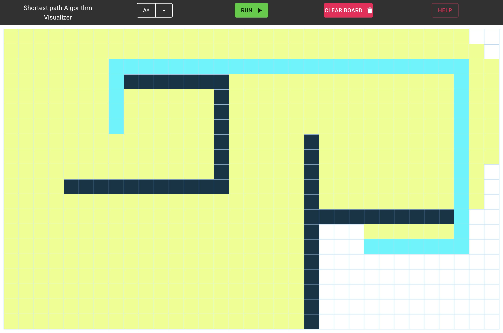

### How does shortest-path algorithms work?

Learning about Dijkstra and A\* in the course **TDAT2004 Datacommunication and Networks** left me with this question. To answer it I wanted to visualize the algorithms by animating the search and the resulting path found.

### Result

The result was a website created using **React** and a bit of CSS. The application lets users pick a start and end point, and put up walls that make the path finding more complicated. Furthermore the user can choose whether the A\* or Dijkstra algorithm should be used for the search.

🔗 [**Visit the website here**](https://nikolaidokken.github.io/algorithmVisualizer/)
