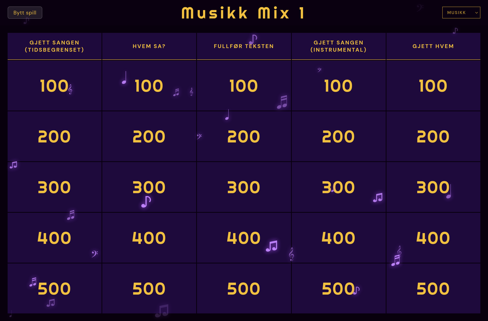

🔗 [**Visit the website**](https://jeopardy.nikolaidokken.no)

Being responsible for coming up with "a fun activity to break the ice" during a party, birthday, after-work is always a hard task. I have found that the gameshow jeopardy is often an effective way for people to get engaged and have fun. It allows for different categories and media-formats so you can have both regular trivia or grab-the-mic.

To host these games I created a Jeopardy app that I can easily bring up on a TV or laptop. Also, it allows me to save my previously created games and even let others enjoy them.

