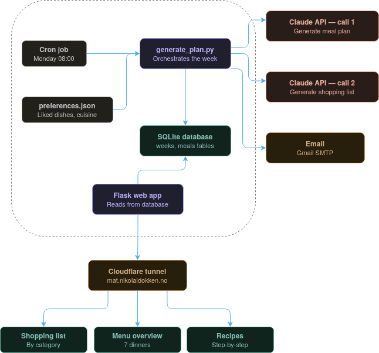
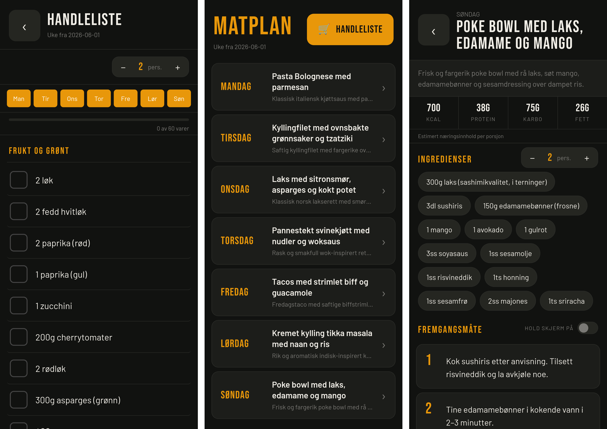

🔗 [**Check out my meal planner**](https://mat.nikolaidokken.no)

**TL;DR** The app above is my personal meal planner and shopping assistant. It generates a new menu each week and assembles a shopping list I can use in the store. When making dinner, it shows me the recipe and guides me through it, step by step.

## The problem

"What do you want to eat today?" is something I always ask or get asked after work. Every time I find it equally difficult to answer and equally demotivating to think that I have to go shopping for whatever we decide to eat. Yes, I could start shopping for the entire week, but that requires me to plan every meal and sit down to write a shopping list, which I am perfectly capable of, but also find extremely boring. This leads to several trips to the grocery store a week and a quite repetitive menu over a period of a few weeks as we often fall back to dishes we know and love. 

We have previously tried meal delivery boxes which we really enjoyed. These solved the problem of not having to go shopping, and not having to decide what to eat each day. The problem with these deliveries is that you have to know well in advance if you won't be home one evening and have to skip a meal. If you aren't able to change the delivery in advance you'll end up with an extra meal going into the next week when a new delivery arrives. Other than that these deliveries are *expensive*.

## My solution

Based on the aforementioned problems, I first of all decided that I would have to buy my own groceries to avoid rigid and pricey meal deliveries. The solution should also spare me unnecessary trips to the store, and let me use my creativity for other things than putting together a shopping list. 

### Architecture

What I decided on is a two-part solution: a meal planner script that runs each week and a companion app. The script makes a few tool calls to claude with the prior weeks' menu and our food-preferences and generates (1) a menu for the week, and (2) an aggregated shopping list. The meals and their ingredients are then stored to a database that can be queried by the companion app. 

### Companion App

