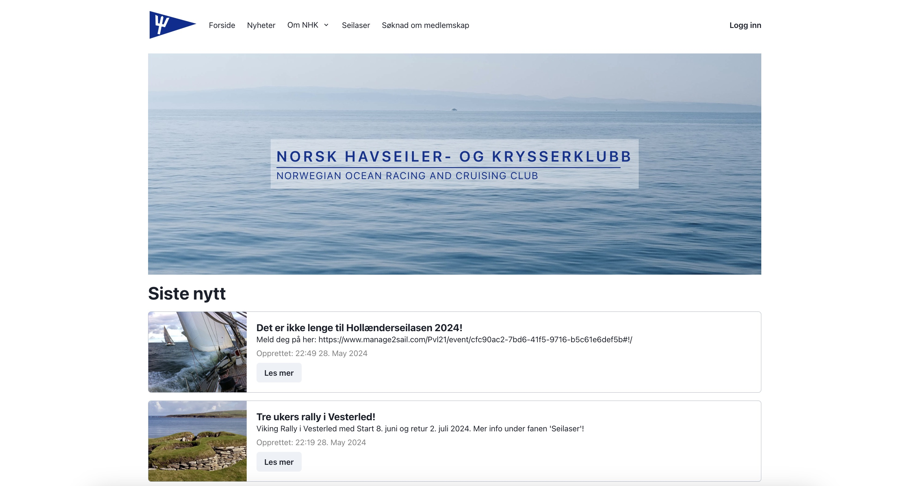

🔗 [Visit the website here](https://havseilerklubben.no/)

After hearing that the Norwegian Ocean Racing and Cruising Club needed a website, I quickly put a demo together that could be presented at their next board meeting. Even though I did not have the chance to present the demo myself, I later learned that the board had liked the site so much that they wanted to proceed with the development of it, and that I now had secured the contract for their new website.

The website is currently being used by the club's 300 members. The members use the site for any news related to the club, to view upcoming events and regattas, and to post requests for crew members or adverts for equipment they want to sell. The content on the website is generated and maintained by the club's administrators that hold special write-permissions.

The result can be seen at [havseilerklubben.no](https://havseilerklubben.no)
